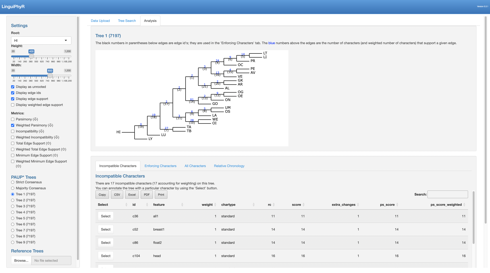

# LinguiphyR

<!-- badges: start -->
[](https://doi.org/10.21105/joss.06201)
  [](https://github.com/marccanby/linguiphyr/actions/workflows/R-CMD-check.yaml)
  <!-- badges: end -->

LinguiphyR is a package that provides an R Shiny app that enables parsimony-based linguistic phylogenetic analysis. You can upload a 
dataset of linguistic characters to the app, run a search to find optimal trees, and analyze the trees using a variety of tools
and visualizations.

## Getting Started

If you have not installed R and RStudio, please follow the instructions at https://posit.co/download/rstudio-desktop/.

**Step 1: Install LinguiphyR**

The latest version can be installed from Github in R Studio. You must first install `ggtree` from `BiocManager`.:

```
if (!requireNamespace("BiocManager", quietly = TRUE)) {
install.packages("BiocManager")
}
BiocManager::install("ggtree")

install.packages("remotes")
remotes::install_github("marccanby/linguiphyr")
```

The same command may be called to upgrade the package.

- Note: If you are asked "Do you want to install from sources the package which needs compilation?", we recommend saying "no".

**Step 2: Install PAUP\***

Tree estimation is performed using PAUP\*, which must be installed separately: 

1. Go to http://phylosolutions.com/paup-test/.

2. For Mac:
     1. Click on `paup4a168_osx.gz`, which will download a zipped file. Unzip it, and rename the resulting `paup4a168_osx` file to `paup`.
       
     2. Move this file to a new directory (e.g. `~/Documents/paup/`) on your computer.

     3. Navigate to this directory, and run <code>chmod a+x paup</code> to enable executable permissions on the file.
         - Note: You may also have to right click on the `paup` executable in Finder and select `Open` to avoid the warning about the software being from an unidentified developer when you later try to call it from the LinguiphyR app.

     5. To make this binary available to R, run the following command in R:

        ```
        Sys.setenv(PATH = paste("~/Documents/paup/:", Sys.getenv("PATH"), sep=""))
        ```
        Replace `~/Documents/paup/` with the directory where you put the PAUP* binary.
This will only make the binary available for your current R session. If you want to make it permanently available, you can add this line to your R profile file, 
which is typically located at `~/.Rprofile` or `~/.Rprofile.site`.

3. For Windows:

     1. Click on `paup4-setup.msi`, follow the directions to install it.

## Running the App

Once the software is installed, you can run LinguiphyR with the following commands:

```
library(linguiphyr)
run_app()
```

## Example Analysis

As can be seen in the figure below, you can analyze linguistic datasets simply by interacting with the user interface (UI), which describes the app's various features.

You can run an example tree search and analysis using the `ringe_screened_dataset.csv` file contained in the `data` folder. 
This file contains a dataset in the format expected by LinguiphyR. 
The dataset is the screened version of the Indo-European dataset published in [Ringe et al., 2002](https://onlinelibrary.wiley.com/doi/abs/10.1111/1467-968X.00091).
Follow these steps:
1. After launching the app, upload `ringe_screened_dataset.csv` on the "Data Upload" page. After doing so, you can see various statistics about the dataset.
2. Click on the "Tree Search" tab and hit "Run PAUP\*" on the left sidebar (you don't need to change the default options). This runs a heuristic maximum parsimony tree search using PAUP\*. A popup window showing "Running....." will appear.
3. Wait for the "PAUP\* Output" text box to populate (note: this may take up to 30 seconds, even after the "Running....." message disappears).
4. Click on the "Analysis" tab. Here, you can visualize the tree found by PAUP\*, annotate internal nodes with reconstructed states, see incompatible characters, and more. We recommend rooting the tree at "HI" ("Hittite"), one of the Anatolian languages, which is the branch believed to break off first.



## How to Contribute

If you have any questions or feedback regarding LinguiPhyR, or encounter a bug, please create an issue, or send an email to marc.canby@gmail.com! 

We also welcome code contributions from the community. Please adhere to the following guidelines:
* If you notice a bug you would like to fix, first raise an issue. Then, create a pull request with your proposed changes.
* If you are interested in suggesting a new feature, first create an issue for others to discuss before proceeding with a pull request.
