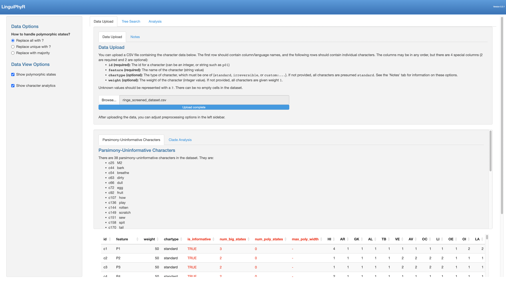
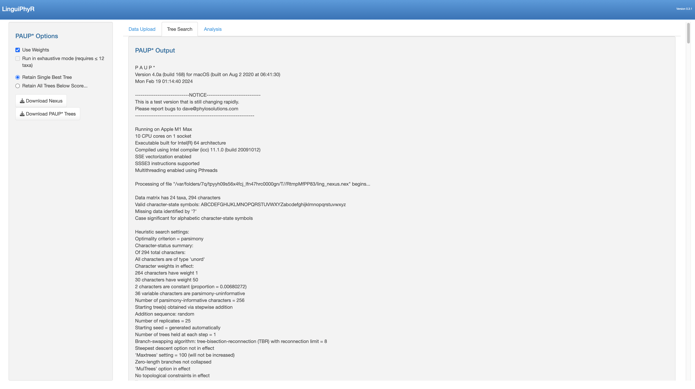
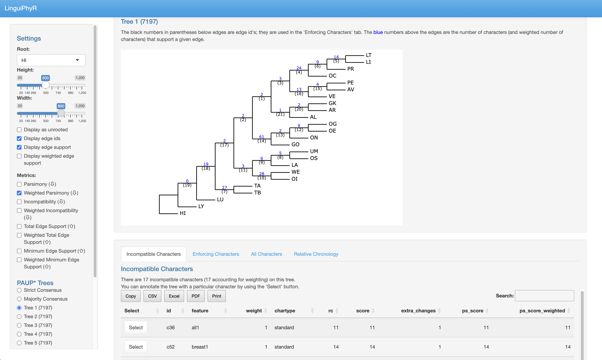

<!---# Optional fields if submitting to a AAS journal too, see this blog post:
# https://blog.joss.theoj.org/2018/12/a-new-collaboration-with-aas-publishing
aas-doi: 10.3847/xxxxx <- update this with the DOI from AAS once you know it.
aas-journal: Astrophysical Journal <- The name of the AAS journal.--->

# Introduction

Phylogenetic methods have become commonplace in historical linguistics research. However, much of the work is highly 
technical and not easily accessible to the typical classically-trained historical linguist. This paper aims to bridge the gap 
between linguistic and statistical research by introducing LinguiPhyR, an R package that provides a graphical 
user interface (GUI) to aid in the phylogenetic analysis of linguistic data. As such, very little computational 
background is required by the user. A linguist may simply upload a dataset, select 
optimization criteria, and visualize the phylogenies found by the search algorithm. Alternatively, one may upload 
trees of interest to be analyzed based on the dataset. Several tools 
for tree analysis are provided: users may examine what characters are responsible for particular splits 
in the tree, see the characters that are incompatible on the tree, annotate internal nodes of the tree with 
reconstructed states, and even see a relative chronology of state changes. 
<!---; this is largely (and understandably) due to the highly mathematical and computational nature of the work--->

We note that, at present, our software focuses on parsimony-based tree estimation and analyses. We make this choice because such an 
approach is easily interpretable: the best tree is simply the tree that minimizes the number of state changes. 
This makes it easy for linguists to see the effect of each character in the dataset on tree search. However, one limitation 
of parsimony-based methods is that they are limited to searching for and analyzing tree topology: studies seeking to explore 
ancestral node dating (glottochronology) or branch lengths are better suited to using likelihood or Bayesian approaches. 
Future work will include the incorporation of other search algorithms and analytical methods into LinguiPhyR.

# Statement of need

Given the recent explosion of linguistic phylogenetic datasets [@heggartyetal; @Tresoldi2023; @herce2023short; @jager2018global], new tools for their analyses are called for. Many linguists
want to perform parsimony analyses of their dataset, and our software makes it easy to do so with little effort.
In this work,
we provide an easy-to-use tool for phylogenetic analysis that emphasizes *interpretability*, allowing linguists to understand
why trees are returned for a particular dataset *or* what evidence a new dataset has for existing trees suggested by the community.
Currently, our software only allows parsimony-based analyses, a decision made because the go-to methods for phylogenetic analysis (Bayesian inference) requires reasonable mathematical maturity to underestand, despite efforts to reduce barrier to entry. Nonetheless, future work will aim to bring other methods (such as distance-based, quartet-based, and Bayesian approaches) into the package. <!--- the go-to method for phylogenetic analysis is Bayesian inference, which, despite efforts to reduce barrier 
to entry, requires reasonable mathematical maturity to understand. --->

<!--- and operates largely as a black-box. --->

The primary goals of LinguiPhyR are to

1. Make phylogenetics accessible by requiring *no* coding or writing of configuration files. While these are useful skills,
giving linguists the option to spend their time analyzing trees in a GUI
rather than writing code will facilitate analyses of phylogenetic inferences.

2. Make it easy to find and visualize trees for a new linguistic dataset. One simply has to upload the dataset and select optimization criteria (or use the
default settings). Trees are then displayed in the app and can be downloaded (either as images or as Nexus files) for inclusion in other work.

3. Provide a comprehensive set of (parsimony-based) analysis tools. These focus on the following questions: why are particular trees being suggested for
the dataset? What evidence does a dataset contain for other trees of interest? What is the effect of particular coding
decisions in the dataset on the understanding of a tree?
<!---5. Provide a platform for phylogenetic visualization. Discussion with many linguists has pointed to the need for an interactive
framework to demonstrate and analyze trees, often in presentation settings or tutorials.--->

<!---4. Make linguistic phylogenetic analysis reproducible. Not only can one download the PAUP\* configuration file, a researcher can download
the trees . Conclusions drawn on the basis of the software can 
thus be easily analyzed by other researchers.--->
<!---The introduction of an easy-to-use interface aids in this goal because a researcher can 
reproduce work simply by uploading the same dataset and running optimization with the same settings.---> 

Our work is not the only attempt to make phylogenetic methods accessible and interpretable to linguists, nor is it the only GUI for this purpose.
For example, PAUP\* [@swofford2002phylogenetic] provides a GUI containing a comprehensive set of parsimony-based tools for phylogenetics, although it does
require writing Nexus configuration files and is not specifically aimed at linguists. Tools specific to Bayesian linguistic phylogenetics 
include BEASTling [@maurits2017beastling], which is a wrapper for BEAST [@bouckaert2014beast], and Traitlab [@kelly2023traitlab]. A useful tutorial in
R for linguistic phylogenetics is @IndoEuropeanphylogeneticswithR.

# LinguiPhyR: Linguistic Phylogenetic Analysis in R

The following sections describe each page of the app: Data Upload, Tree Search, and Analysis.
Throughout the subsequent discussion, many terms familiar to historical linguists are used (e.g. *clade*, *cognate*, and *regular sound change*); 
we suggest @ringeska for further reading. Similarly, we recommend @warnow2017computational for terms common in
the phylogenetics literature, such as *character*, *polymorphism*, and *parsimony*.

## Data Upload

The first page of the app is shown in \autoref{fig:figure1}. The user first uploads a dataset of linguistic characters, which encode certain properties about languages that are likely
to be relevant to the branching structure of the underlying tree. The characters should
be uploaded as a CSV file. An example of the data format is shown below[^1]:

| id   | feature | weight | chartype | HI | AR | GK | AL | TB | VE | AV | OC | LI | $\cdots$
| ----------- | ----------- | ----------- | ----------- | ----------- |----------- |----------- |----------- |----------- |----------- |----------- |----------- |----------- |-----------
| c1      | P1       | 50|standard|4 | 1 | 1 | 1 | 1 | 1 | 1 | 1 | 1  |$\cdots$
| c26   | M3        |50|standard|1 | 2 | 2 | 3 | 2 | 2 | 2 | 2 | 4 |$\cdots$
| c50 | bird |1|standard|1 | 2 | 3 | 4 | 5 | 6 | 6 | 7 | 8 |$\cdots$

Table: Example dataset specification, excerpted from the Indo-European dataset of @ringe2002indo.

[^1]: We provide the screened version of the Indo-European dataset of @ringe2002indo in the correct format at the path
`data/ringe_screened_dataset.csv` in the LinguiPhyR Github repository.

<!---, and the columns represent attested languages (the leaves of the tree). --->
Each row represents a character. The first four columns
specify special character information: a unique character ID, the character name ("feature"), the weight of the character (optional,
to be used in parsimony analyses), and the character type (which can be *standard*, *irreversible*, or *custom*, explained below). The remaining columns
contain the character states for each attested language (i.e. the leaves of the tree). 

Two languages should be given the same state for a character *if and only if* the languages' realization of that character
could be from a common genetic source (and not, for example, from borrowing). For lexical data, characters typically represent particular 
semantic slots (such as "bird" in the table above), and
languages should share a state if their words for that meaning are cognate $-$ that is, the words are derived from a common ancestor via regular sound change.
However, if two languages share the same cognate due to detected borrowing or some other known non-genetic source, then
the languages should be given different states for that character. 
Such cognate judgements are thus critically important to phylogenetic analysis; an abundance of phylogenetics literature discusses good methodology for doing designing characters [@ringe2002indo; @tutorialNicholsWarnow; @heggarty2021cognacy]. Classical historical linguistics references are also helpful [@ringeska; @campbell2013historical]. 
Finally, our coding scheme is applicable to phonological, morphological, and structural/typological characters.

Each character may be declared “standard”, “irreversible”, or “custom”. Standard characters permit any change of state 
(e.g. from 0 to 1 or from 1 to 2) with uniform cost, and is generally appropriate for lexical characters. Irreversible characters are binary characters that may transition from 0 to 1 but not from 1 to 0; this is useful for representing phonological mergers, which are generally considered irreverisble. Finally, custom characters allow the user to declare which state transitions are allowed and the cost of each. <!---The exact way to specify this is described in the "Data Upload" page of the app.--->

Finally, our data format supports *multi-state* and *polymorphic* characters. Multi-state characters can take more than 2 states. While it is common to convert multi-state characters into a set of independent binary traits, we recommend leaving such characters in their underlying multi-state form unless the estimation algorithm explicitly requires binary characters; for further discussion, see @rexova2003cladistic, @tutorialNicholsWarnow, and @heggarty2021cognacy. Datasets may also contain polymorphic characters, which are those for which a language exhibits more than one state; for example, a language may manifest two cognate classes for the same semantic slot [@canby2024]. Such examples are denoted by separating the states with a */* (e.g. *1/2*).

After uploading the data, the app presents some statistics:

* **Parsimony Uninformative Characters:** The characters that are not *parsimony informative* are displayed. These characters
will have no effect on parsimony-based tree estimation because they can be fit equally well to any tree (see @warnow2017computational for a discussion). This 
is especially helpful to a linguist, who may not be thinking about the consequences of character codings to 
the parsimony algorithm when coding individual characters.

* **Character-level Statistics:** Various information about each character is displayed, such as the number of
languages having polymorphic states for that character and whether or not
the character is parsimony-informative. The dataset may be sorted by these metrics.

* **Clade Analysis:** The user may select a subset of languages and analyze what characters provide support for 
such a clade (a clade is a subset of languages separated from all other languages by an edge in the tree).
This is computed in the strictest sense: a character only supports a hypothetical clade if the languages
in the clade all share the same state, and all other languages share a different state.[^2]

[^2]: Note that a clade *on a particular tree* may be supported by more than the characters that meet 
this condition. For example, if the dominant cognate class in a clade is lost by just one language in the clade, the character 
will still support the grouping if the removal of the edge separating the clade from all other languages would produce a 
less parsimonious tree. This can be examined in the "Analysis" page.

## Tree Search

On the second page of the app (shown in \autoref{fig:figure2}), the user can conduct a search for the optimal tree(s) for the 
dataset. We use PAUP\* [@swofford2002phylogenetic] to perform tree search, a well-established package in the biological community for running parsimony 
and other phylogenetic analyses. The user may specify various optimization criteria in the app without
writing configuration files by hand, which is a big barrier to entry for many linguists. Nonetheless, users may download these 
configuration files from the app and modify them as needed.

## Analysis

Finally, one may use the dataset to analyze trees, depicted in \autoref{fig:figure3}. These trees can be either the result of a PAUP\* tree search, or 
specific trees may be uploaded by the user. This latter option is especially helpful for determining the support that a
dataset exhibits for various trees accepted by the community. Strict and majority consensus trees for the trees returned by PAUP\*
are displayed as well. The following analyses may be performed on each tree:

1. **Tree Score:** Each tree is scored using various metrics, including *parsimony*, *compatibility*, *total edge support*, and
*minimum edge support*[^3]. Hence, the trees can be ranked according to these options.

[^3]: The compatibility score is the total number of characters that evolve on the tree without homoplasy (see @warnow2017computational 
for further detail). To calculate total edge support and minimum edge support, we first calculate the number of characters that enforce, 
or support, each edge, based on whether or not the collapse of that edge would increase the parsimony score. Total edge support is the 
sum of these support values across all edges, and minimum edge support is the minimum of these values.

2. **Character annotations:** The most parsimonious annotation(s) of a character's
states are displayed on the tree (including inferred states at internal nodes). This is convenient for studying a character's behavior, and can help a linguist
interpret the consequences of particular character codings on phylogeny estimation.
<!--- For example, when coding the absence of a feature, a linguist has two choices: either code all languages without the feature with the same state (e.g. $0$), or code them all with different states. The former choice would suggest the absence of feature as evidence of a clade among those languages without the feature, while the latter would suggest that absence of the feature is not evidence that the languages are related. By annotating the states of each choice on proposed trees, the linguist can see the most parsimonious evolution patterns for both codings.--->

3. **Incompatible characters:** The characters not compatible on the tree are displayed. This is useful
for considering the plausiblity of various trees: if the set of incompatible characters seems unrealistic, 
a linguist may wish to discard the tree in favor of other options.

4. **Enforcing characters:** This reports the characters that enforce, or support, each edge. A character is deemed to
support an edge if and only if the edge’s collapse increases the tree's parsimony score. One can thus analyze evidence for 
and against various clades.

5. **Relative chronology:** This displays a relative chronology of state changes *across* characters. This is calculated by first
determining the most parsimonious state transitions for each character, and then ordering these transitions based on
the edges they occur on from the root of the tree to a specified clade. This type of relative chronology may seem unusual to the
typical historical linguist, but its results can be illuminating.

# Conclusions

We present LinguiPhyR, a tool for analyzing phylogenetic datasets and trees via a graphical user interface. Even for experienced 
programmers, LinguiPhyR can quickly enable analysis on a new linguistic dataset or provide a starting place
for finding new trees. We especially emphasize 
(parsimony-based) interpretability
by providing visualizations and tools to see the impact of certain coding decisions on tree estimation. Future work will incorporate other inference and analytical methods, such as likelihood-based or quartet approaches.

<!---# Citations

Citations to entries in paper.bib should be in
[rMarkdown](http://rmarkdown.rstudio.com/authoring_bibliographies_and_citations.html)
format.

If you want to cite a software repository URL (e.g. something on GitHub without a preferred
citation) then you can do it with the example BibTeX entry below for @fidgit.

For a quick reference, the following citation commands can be used:
- `@author:2001`  ->  "Author et al. (2001)"
- `[@author:2001]` -> "(Author et al., 2001)"
- `[@author1:2001; @author2:2001]` -> "(Author1 et al., 2001; Author2 et al., 2002)"

# Figures

Figures can be included like this:

and referenced from text using \autoref{fig:example}.

Figure sizes can be customized by adding an optional second parameter:
{ width=20% }--->

# Acknowledgements

The author would like to acknowledge Thomas Olander, Matthew Scarborough,
Simon Poulsen, Anders Jørgensen, Stefanos Baziotis, and Tandy Warnow, who have all provided invaluable feedback throughout
the project.

This research was supported by the research project Connecting the Dots: Reconfiguring the Indo-European Family Tree (2019–2024), financed by the Independent Research Fund Denmark (project number 9037-00086B).

# References
